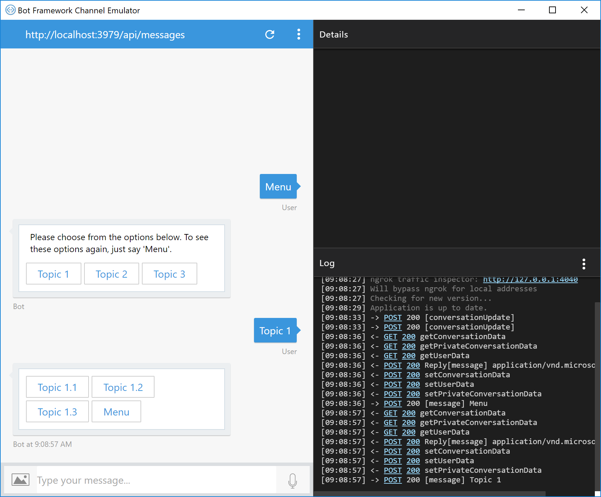

# Navigation Sample Bot

A sample that shows how to add conversation navigation to a bot to allow users to easily discover and access the features of your bot.

### Prerequisites

To run this sample, install the prerequisites by following the steps in the [Bot Builder SDK for .NET Quickstart](https://docs.microsoft.com/en-us/bot-framework/dotnet/bot-builder-dotnet-quickstart) section of the documentation.

This sample assumes you're familiar with:
* [Bot Builder for .NET SDK](https://dev.botframework.com/)
* [Dialog API](https://docs.botframework.com/en-us/csharp/builder/sdkreference/dialogs.html)
* [Global Message Handlers](https://docs.microsoft.com/en-us/bot-framework/dotnet/bot-builder-dotnet-global-handlers)

### Overview

#### App Navigation

In mobile or web app navigation, the UI canvas includes navigation UI (e.g. navigation header, breadcrumb, links, a back button, buttons, content, etc.) that not only provides navigation to the features of the app, but also promotes discoverability and wayfinding in the app. 

The navigation UI in apps provides discoverability of the features and content of the app just by being visible on the UI canvas. Users are accustomed to scrolling around and clicking on the UI controls and content they see to access hte features and content of the app. 

The navigation UI in apps promotes wayfinding for users by communicating where the user can go (e.g. navigation headers or menus, links, buttons, content), where they are (e.g. breadcrumbs, page content), and how they can get back (e.g. back button). These wayfinding tools help users feel comfortable exploring the app. Users know where they are in the app, how they got there, and how to get back, so they feel free to explore.

Like web sites and mobile apps, bots are just apps. But, what is navigation in a bot? How do you navigate a conversation? How do you make the features, or navigation options, of your bot discoverable? How to do promote wayfinding in a bot so users feel free to explore the capabilities and features of the bot?

#### Bot Navigation

In a bot, navigation is the ability for the user to change the topic of conversation. Navigation allows the user to say "I want to talk about this vs. that".

Bots need to differentiate between the user wanting to navigate, or change the topic of conversation, from the user just replying to the current prompt in the current conversation.

Bots support navigation commands to support changes in the topic of conversation. Navigation commands are key words or phrases that the bot listens for in the conversation. If the bot receives a navigation command, the bot changes the topic of conversation to correspond to the navigation command. For example, a bot for a chain of retail stores could listen for the word "Locations" to change the conversation to talk about their locations (e.g. helping the user find and learn about the location near them).

Navigation commands are different from replies. Replies are responses to the current prompt in the current dialog. Replies move the current conversation forward. For example, if the current prompt in the conversation flow is "What is your name?", the user might respond with "My name is Chris", a reply to that question.

Bots can make their conversation navigation discoverable by introducing those navigation commands into the conversation via conversation UI (text, cards, buttons, etc.) so the user will know where they can take the conversation and how they can take it there.

Bots can promote wayfinding in the conversation by introducing navigation commands into the conversation that make it easy to revisit conversation topics or to return to top level navigation.

#### Implementing Navigation Commands

In this sample, navigation commands are implemented via [Global Message Handlers](https://docs.microsoft.com/en-us/bot-framework/dotnet/bot-builder-dotnet-global-handlers). Review the Global Message Handler sample to understand how `Autofac`, `IScorable` and `Scorablebase` are used in the Bot Builder SDK to implement global message middleware. In this sample, Global Message Handlers examine every message in the conversation looking for navigation commands. When the text of a message to the bot matches a navigation command, the bot resets the dialog stack and starts the conversation flow that corresponds to the command.

Since these these navigation commands are implemented as Global Message Handlers, they are available from anywhere in the conversation, whether the user clicks on a button or just types the command.

Simple text matching is used in this sample to identify navigation commands in the conversation, but more advanced methods such as regular expressions or natural language processing (for examle via [LUIS](https://www.luis.ai/)) could also be used.

Navigation is made discoverable by introducing navigation UI into the conversation. This can be done, for example, via HeroCards with and buttons at key points in the conversation. User can easily see their navigation options without having to remember specific commands.

Wayfinding is promoted by providing conversational UI that makes it easy for the user to return to a prior topic of conversation or to be reminded of all the possible topics of conversation. 

**Note:** In this sample, navigation commands like "Back" and "Cancel" aren't used, since they feel unnatural within a conversation. Rather than providing navigation commands that move the conversation back ("Back", "Cancel"), navigation UI is provided to move the conversation forward. This is done by providing navigation commands that allow the user to tell you what they want to talk about next, rather than providing commands to move back in the conversation. 

Let's look at the sample in action.

### Sample Walkthrough

In this sample, NavigationBot has a navigation hierarchy of three conversation topics the user can navigate to (Topic 1, Topic 2, Topic 3 in the sample) with each conversation topic having three conversation sub-topics (Topic 1.1, Topic 1.2, and Topic 1.3),

Run NavigationBot and type "Menu". This will cause NavigationBot to reply with a navigation menu to shows the bot's conversation topics/features with buttons the user can click on to navigate to those capabilities.  This promotes discoverability. 

Note the hint letting the user know they can say "Menu" at any time to see this menu again. This promotes wayfinding. The user always knows how to return to this menu, so they don't have to worry about getting lost.


Click on the "Topic 1" button to navigate to that conversation topic. Again, NavigationBot will respond with a navigation menu for all the conversation topics for Topic 1.



Click on "Topic 1.1". This launches a conversation flow (one or more `IDialogs` with prompts to manage a conversation) for Topic 1.1. For the sample, the conversation flow just shows text and allows the user to see more by replying with "More" via a button. 


Click "More" to move to the next text/prompt.


If you reply with anything other than a navigation command, the bot has to assume the message is a reply to the current prompt. If the reply isn't an valid response to the current prompt ("More"), NavigationBot won't understand the response and will reprompt.

Type something other than "More".


When the Topic 1.1 dialog completes, it's shows a menu with buttons for navigation commands to help the user navigate back to Topic 1 or to the top level navigation menu.


Click the "Topic 1" button to see that menu again.


Click the "Menu" button to return to the top-level navigation menu.


Let's look at how this is done in code.

### Code Walkthrough

#### Creating the Navigation Global Message Handler

The navigation middleware is implemented in the [`NavigationScorable`](Navigation\NavigationScorable.cs) class, which implements the `IScorable` interface by inheriting from `ScorableBase`.

`NavigationScorable` uses it's `navigationCommands` variable to store all the navigation commands implemented in the bot. 

````C#
    public class NavigationScorable : ScorableBase<IActivity, string, double>
    {
        private IDialogStack stack;
        private IDialogTask task;

        // TODO: Move navigation commands to the Root dialog so these commands are only defined in a single location.
        // List of navigation commands that will, if matched to the text of the incoming message, trigger navigation to another dialog/conversation flow.
        private List<string> navigationCommands;
        
        public NavigationScorable(IDialogStack stack, IDialogTask task)
        {
            SetField.NotNull(out this.stack, nameof(stack), stack);
            SetField.NotNull(out this.task, nameof(task), task);

            this.navigationCommands = new List<string>();

            this.navigationCommands.Add(Resources.Main_Nav_Cmd);

            // Topic 1
            this.navigationCommands.Add(Resources.Topic1_Nav_Cmd);
            this.navigationCommands.Add(Resources.Topic1_1_Nav_Cmd);
            this.navigationCommands.Add(Resources.Topic1_2_Nav_Cmd);
            this.navigationCommands.Add(Resources.Topic1_3_Nav_Cmd);

            // Topic 2
            this.navigationCommands.Add(Resources.Topic2_Nav_Cmd);
            this.navigationCommands.Add(Resources.Topic2_1_Nav_Cmd);
            this.navigationCommands.Add(Resources.Topic2_2_Nav_Cmd);
            this.navigationCommands.Add(Resources.Topic2_3_Nav_Cmd);

            // Topic 3
            this.navigationCommands.Add(Resources.Topic3_Nav_Cmd);
            this.navigationCommands.Add(Resources.Topic3_1_Nav_Cmd);
            this.navigationCommands.Add(Resources.Topic3_2_Nav_Cmd);
            this.navigationCommands.Add(Resources.Topic3_3_Nav_Cmd);
        }
````

When messages are received by the bot, they are inspected in `PrepareAsync()` to see if they match one of the navigation commands.

````C#
        protected override async Task<string> PrepareAsync(IActivity activity, CancellationToken token)
        {
            var message = activity as IMessageActivity;

            if (message != null && !string.IsNullOrWhiteSpace(message.Text))
            {
                var command = (from cmd in this.navigationCommands
                               where message.Text.Equals(cmd, StringComparison.InvariantCultureIgnoreCase)
                               select cmd).FirstOrDefault();

                if (command != null)
                {
                    return message.Text;
                }
            }

            return null;
        }
````

If the message matches a navigation command, `PostAsync()` is called, where the dialog stack is reset and the message is forwarded to `RootDialog` to start a new conversation flow.

````C#
        protected override async Task PostAsync(IActivity item, string state, CancellationToken token)
        {
            var message = item as IMessageActivity;

            if (message != null)
            {
                this.stack.Reset();

                var rootDialog = new RootDialog();

                await this.stack.Forward(rootDialog, null, message, CancellationToken.None);
                await this.task.PollAsync(CancellationToken.None);
            }
        }
````

#### Fielding the Navigation Command in RootDialog

In [`RootDialog`](Dialogs\RootDialog.cs), `MessageReceived()` fields the navigation commands for the bot, either by showing the bot's navigation menu ("Menu"), via `ShowNavMenuAsync()`, or by loading the dialog that corresponds to the navigation command ("Topic 1").

`RootDialog1` only expects navigation commands. If the message is not a navigation command, `RootDialog` lets the user know via a "Do not understand" message and showing the navigation menu again.

````C#
    [Serializable]
    public class RootDialog : IDialog<object>
    {
        public async Task StartAsync(IDialogContext context)
        {
            context.Wait(this.MessageReceived);
        }

        private async Task MessageReceived(IDialogContext context, IAwaitable<IMessageActivity> result)
        {
            var message = await result;

            // If the message matches a navigation command, take the correct action (post something to the conversation, call a dialog to change the conversation flow, etc.
            if (message.Text.ToLowerInvariant() == Resources.Main_Nav_Cmd.ToLowerInvariant())
            {
                await this.ShowNavMenuAsync(context);
            }
            // Topic 1
            else if (message.Text.ToLowerInvariant() == Resources.Topic1_Nav_Cmd.ToLowerInvariant())
            {
                context.Call(new Topic1Dialog(), this.TopicX_X_DialogResumeAfter);
            }
            else if (message.Text.ToLowerInvariant() == Resources.Topic1_1_Nav_Cmd.ToLowerInvariant())
            {
                context.Call(new Topic1_1_Dialog(), this.TopicX_X_DialogResumeAfter);
            }
            else if (message.Text.ToLowerInvariant() == Resources.Topic1_2_Nav_Cmd.ToLowerInvariant())
            {
                context.Call(new Topic1_2_Dialog(), this.TopicX_X_DialogResumeAfter);
            }
            else if (message.Text.ToLowerInvariant() == Resources.Topic1_3_Nav_Cmd.ToLowerInvariant())
            {
                context.Call(new Topic1_3_Dialog(), this.TopicX_X_DialogResumeAfter);
            }

            // ...

            else
            {
                // Else something other than a navigation command was sent, and this dialog only supports navigation commands, so explain the bot doesn't understand the command.
                await this.StartOverAsync(context, string.Format(Resources.Do_Not_Understand, message.Text));
            }
        }
````

`ShowNavMenuAsync()` posts `RootDialog`'s navigation menu to the conversation via a `HeroCard`, with `CardAction` buttons for it's top level conversation topics ("Topic 1", "Topic 2", "Topic 3"). That menu also has reminder to the user on how to show that menu again (typing "Menu" at any time). 

````C#
        private async Task ShowNavMenuAsync(IDialogContext context)
        {
            var reply = context.MakeMessage();

            var menuHeroCard = new HeroCard
            {
                Text = "Please choose one of the topics below. You can see these options again at anytime by saying 'Menu'".,
                Buttons = new List<CardAction>
                {
                    new CardAction(ActionTypes.ImBack, Resources.Topic1_Nav_Cmd, value: Resources.Topic1_Nav_Cmd),
                    new CardAction(ActionTypes.ImBack, Resources.Topic2_Nav_Cmd, value: Resources.Topic2_Nav_Cmd),
                    new CardAction(ActionTypes.ImBack, Resources.Topic3_Nav_Cmd, value: Resources.Topic3_Nav_Cmd),
                }
            };

            reply.Attachments.Add(menuHeroCard.ToAttachment());

            await context.PostAsync(reply);

            context.Wait(this.ShowNavMenuResumeAfterAsync);
        }

        private async Task ShowNavMenuResumeAfterAsync(IDialogContext context, IAwaitable<IMessageActivity> result)
        {
            var message = await result;

            // If we got here, it's because something other than a navigation command was sent to the bot (navigation commands are handled in NavigationScorable middleware), 
            //  and this dialog only supports navigation commands, so explain bot doesn't understand the message.
            await this.StartOverAsync(context, string.Format(Resources.Do_Not_Understand, message.Text));
        }
````

Navigation commands are forwarded to `RootDialog` from the `NavigationScorable` so `RootDialog` can respond whether the dialog for the navigation commands completes successfully via `Done()` or unsuccessfully via `Fail()`.

````C#
        private async Task TopicX_X_DialogResumeAfter(IDialogContext context, IAwaitable<object> result)
        {
            try
            {
                var diagResults = await result;
            }
            catch (Exception ex)
            {
                throw ex;
            }
            finally
            {
                await this.ShowNavMenuAsync(context);
            }
        }
````

#### Topic1Dialog

[`Topic1Dialog1`](Dialogs\Topic1Dialog.cs), like `RootDialog`, is a pure navigation dialog, showing a navigation menu with buttons that correspond to its navigation sub-topics ("Topic 1.1", "Topic 1.2", "Topic 1.3"). If the user clicks one of the buttons on the menu or types a navigation command, the command is posted to the conversation and picked up by `NavigationScorable` and passed to `RootDialog`. `RootDialog` will call the appropriate dialog to add it to the stack. A message other than a navigation command (e.g. "Menu" or "Topic 1.1.")won't be understood by the bot and the navigation menu will be reshown along with a "do not understand" message.

````C#
    [Serializable]
    public class Topic1Dialog : IDialog<object>
    {
        public async Task StartAsync(IDialogContext context)
        {
            await this.ShowNavMenuAsync(context);
        }

        private async Task ShowNavMenuAsync(IDialogContext context)
        {
            var reply = context.MakeMessage();

            var menuHeroCard = new HeroCard
            {
                Buttons = new List<CardAction>
                {
                    new CardAction(ActionTypes.ImBack, Resources.Topic1_1_Nav_Cmd, value: Resources.Topic1_1_Nav_Cmd),
                    new CardAction(ActionTypes.ImBack, Resources.Topic1_2_Nav_Cmd, value: Resources.Topic1_2_Nav_Cmd),
                    new CardAction(ActionTypes.ImBack, Resources.Topic1_3_Nav_Cmd, value: Resources.Topic1_3_Nav_Cmd),
                    new CardAction(ActionTypes.ImBack, Resources.Main_Nav_Cmd, value: Resources.Main_Nav_Cmd)
                }
            };

            reply.Attachments.Add(menuHeroCard.ToAttachment());

            await context.PostAsync(reply);

            context.Wait(this.ShowNavMenuResumeAfterAsync);
        }

        private async Task ShowNavMenuResumeAfterAsync(IDialogContext context, IAwaitable<IMessageActivity> result)
        {
            var message = await result;

            // If we got here, it's because something other than a navigation command was sent to the bot (navigation commands are handled in NavigationScorable middleware), 
            //  and this dialog only supports navigation commands, so explain bot doesn't understand the message.
            await this.StartOverAsync(context, string.Format(Resources.Do_Not_Understand, message.Text));
        }

        private async Task StartOverAsync(IDialogContext context, string text)
        {
            var message = context.MakeMessage();
            message.Text = text;
            await this.StartOverAsync(context, message);
        }

        private async Task StartOverAsync(IDialogContext context, IMessageActivity message)
        {
            await context.PostAsync(message);
            await this.ShowNavMenuAsync(context);
        }
    }
````

#### Topic1_1_Dialog

[`Topic1_1_Dialog`](Dialogs\Topic1_1_Dialog.cs), is a conversation flow dialog that prompts the user and expects specific replies to move the conversation forward. 

In `StartAsync()`, the user is shown some conversation text and offered to move the conversation forward via a [`PromptDialog.Choice()`](https://docs.botframework.com/en-us/csharp/builder/sdkreference/d9/d03/class_microsoft_1_1_bot_1_1_builder_1_1_dialogs_1_1_prompt_dialog.html#a27c7bcc6d37046cc15895a9bbda14b6b) (just by replying with "More"). If the user replies with any of the navigation commands for the bot, that will be picked up by `NavigationScorable`, which will handle the navigation. All other replies from the user will be assumed to be replies to the current prompt.

If they user replies with "More", `FirstPromptResumeAfter()` will be called. If the user replies with anything else, `PromptDialog.Choice()' will reprompt 3 times before failing the dialog.

````C#
    public class Topic1_1_Dialog : IDialog<object>
    {
        public async Task StartAsync(IDialogContext context)
        {
            PromptDialog.Choice(context, this.FirstPromptResumeAfter, new[] { Resources.MoreReply }, "Topic 1.1 Dialog dialog text...", "I'm sorry, I don't understand. Please try again.");
        }

        private async Task FirstPromptResumeAfter(IDialogContext context, IAwaitable<string> result)
        {
            try
            {
                var message = await result;

                if (message == Resources.MoreReply)
                {
                    PromptDialog.Choice(context, this.SecondPromptResumeAfter, new[] { Resources.MoreReply }, "Topic 1.1 Dialog second dialog text...", "I'm sorry, I don't understand. Please try again.");
                }
            }
            catch (TooManyAttemptsException)
            {
                context.Fail(new TooManyAttemptsException("Too many attempts."));
            }
        }

````

When `Topic1_1_Dialog`'s conversation flow is complete, the dialog shows a `PromptDialog.Choice()` prompt providing the user some navigation commands to either return to `Topic1Dialog` ("Topic1") and see it's navigation menu or to return to `RootDialog` ("Menu") to see the top level navigation menu.

````C#
        private async Task ThirdPromptResumeAfter(IDialogContext context, IAwaitable<string> result)
        {
            try
            {
                var message = await result;

                if (message == Resources.MoreReply)
                {
                    PromptDialog.Choice(context, this.FourthPromptResumeAfter, new[] { Resources.Topic1_Nav_Cmd, Resources.Main_Nav_Cmd }, "Topic 1.1 Dialog is done. What do you want to do next?...", "I'm sorry, I don't understand. Please try again.");
                }
            }
            catch (TooManyAttemptsException)
            {
                context.Fail(new TooManyAttemptsException("Too many attempts."));
            }
        }

        private async Task FourthPromptResumeAfter(IDialogContext context, IAwaitable<string> result)
        {
            try
            {
                var message = await result;

                // If we got here, it's because something other than a navigation command was sent, and at this point only navigation commands are supported.
                await this.StartOverAsync(context, $"I'm sorry, I don't understand '{ message }'.");
            }
            catch (TooManyAttemptsException)
            {
                context.Fail(new TooManyAttemptsException("Too many attempts."));
            }
        }
````

In the sample walkthrough and code above above, you can see how the bot:
* Provides users simple commands they can use to navigate to different conversatoin topics from anywhere in the conversation.
* Delineate between navigation commands and replies to the current prompt.
* Provides navigation discoverabliltiy by showing the navigation commands within the conversation via menus and buttons so the user can see the capabilities of the bot and easily navigate to them.
* Promotes wayfinding by providing navigation commands throughout the conversation to help users navigate the capabilities of the bot.

### More information

* [Bot Builder for .NET SDK](https://dev.botframework.com/)
* [Dialog API](https://docs.botframework.com/en-us/csharp/builder/sdkreference/dialogs.html)
* [Global Message Handlers](https://docs.microsoft.com/en-us/bot-framework/dotnet/bot-builder-dotnet-global-handlers)